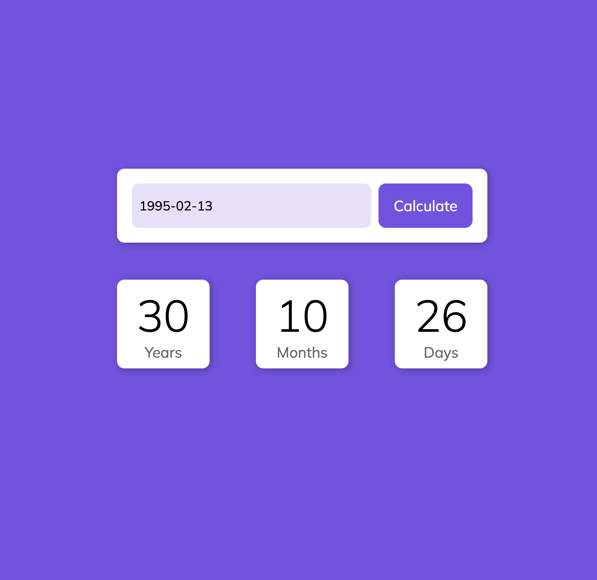

# Age Calculator

A simple and interactive Age Calculator built using **JavaScript**, **Luxon**, and **Flatpickr**.

## Demo

---

## Usage
- Open [Live Demo](https://chrisreliga.github.io/age-calculator/) in your browser.
- Select your date of birth using the calendar.
- Click **Calculate** to see your age displayed.

---

## Technologies Used
- HTML5
- CSS3
- JavaScript
- [Luxon](https://moment.github.io/luxon/) for date/time calculations
- [Flatpickr](https://flatpickr.js.org/) for the date picker input

---

## What I Learned
- Using JavaScript libraries to enhance user experience
- Handling dates and time calculations with Luxon
- Integrating a date picker input (Flatpickr)
- DOM manipulation for dynamic updates

---

## Author
Chris Religa  
[Portfolio](your-portfolio-link) | [GitHub](https://github.com/chrisreliga)
